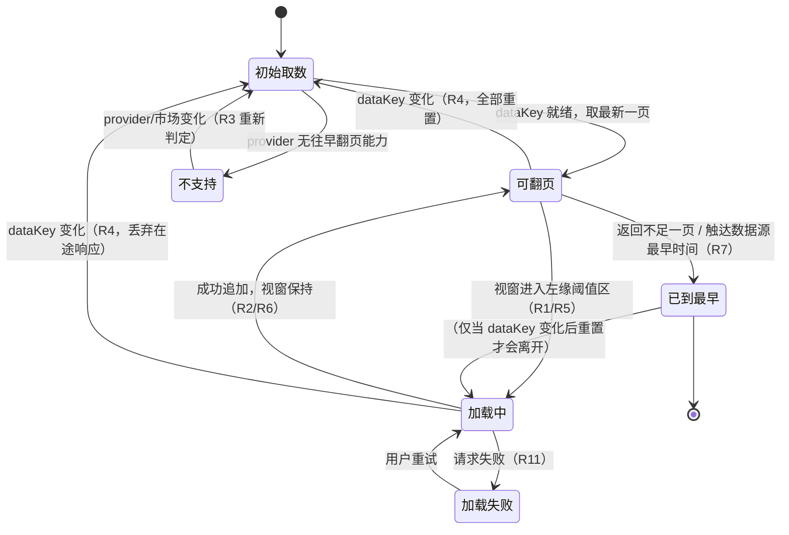

# PRD：行情图表历史数据左缘惰性分页

| 项 | 内容 |
| --- | --- |
| Language | 简体中文（UI 文案中英词典驱动） |
| 技术栈 | 桌面端插件 monorepo（Vite + React + MUI + Tailwind CSS 前端；Connector 插件宿主） |
| Project Name | `dsh_tv_history_paging` |
| 产出人 | 许清楚（产品经理） |
| 日期 | 2026-09-19 |
| 关联任务 | `#1 编写 PRD：图表历史数据懒加载` |

## 0. 原始需求复述

> 用户诉求原话：「项目中的 tradingview 目前不可以左右滚动加载更多历史数据，请优化这部分内容，要支持加载所有历史数据」

**需求实质**：中栏行情图必须能往更早的时间持续加载历史 K 线，而不是在固定条数处停住。

**已核实根因（不由本 PRD 推翻）**：不是纯前端交互问题，而是「数据只有那么多根 + 取数接口没有往更早翻页的能力」双重限制。见 §2。

## 1. 产品定义

### 1.1 产品目标

| # | 目标 | 可验证判据（成功判据） |
| --- | --- | --- |
| G1 | 具备往早翻页能力的数据源，用户可连续回溯至该源最早可用时间 | 在左缘持续触发分页后，图上时间轴左端能不断出现更早 K 线；累计加载根数可超过现有单次上限（日线 750 / crypto 300 / 其他 500），直至数据源最早时间 |
| G2 | 分页对用户是"无感"的——不跳动、不闪断、不重复 | 每次分页追加后，用户当前视窗的时间范围与缩放级别保持不变；同一时间戳的 K 线在图上不出现重复、不出现缺口 |
| G3 | 能力边界诚实：不支持的源不假装支持 | 当前激活 provider 无往早翻页能力时，左缘触发不再发起请求，且 UI 明确提示该数据源不支持更早历史 |

### 1.2 用户故事

| # | 角色 | 我想要 | 以便 |
| --- | --- | --- | --- |
| US1 | 做长周期形态分析的分析师 | 在日线图上向左连续拖动时能一直看到更早的 K 线 | 在图上直接观察多年趋势/大级别形态，不必换工具 |
| US2 | 复盘交易者 | 切换标的或切换周期后，图表从该标的/周期自己的最新数据重新开始，且我再次向左拖时能继续回溯 | 不会看到上一个标的的历史串台，也不会因为"游标没重置"而拉错区间 |
| US3 | 使用多市场（crypto/US/CN/HK）的用户 | 在任何一个市场页签里向左拖都能得到一致的加载体验 | 不必记住"哪个市场支持拖、哪个不支持" |
| US4 | 使用不支持翻页的数据源的用户 | 拖到左端时立刻看到"该数据源不支持更早历史"，而不是无声无息地卡住或反复转圈 | 明确知道这是数据源的限制，不会再无意义地反复拖动 |
| US5 | 关注合规的用户 | 图表只从本插件自带行情桥取数，不上传也不缓存转发我的历史数据 | 放心在境内合规口径下使用 |

### 1.3 硬约束（必须写进实现，不可协商）

| # | 约束 | 说明 |
| --- | --- | --- |
| C1 | 行情数据必须走自家 connector（`/dshtrading/api` 桥） | **禁止**接入第三方行情服务或 TradingView 云端数据源。分页只能扩展本仓 connector → bridge → client 这条链路。 |
| C2 | 不得内置密钥 | 携带凭证的源（BYOK 语义）不得把密钥写入仓库/打包产物 |
| C3 | 数据不得再分发（无缓存再分发口径） | 历史数据**不做跨会话持久化缓存**（见 §4 P2 排除项），仅在当前会话内存中持有 |
| C4 | 不得读取用户个人持仓或交易历史 | 本需求仅涉及公共行情 K 线，不触碰账户侧数据 |
| C5 | 不承诺收益、不构成投资建议 | 新增文案不得出现预测性/建议性表述 |
| C6 | 客群为中文用户 | 所有新增 UI 文案走项目既有 locales 词典机制，zh/en 双语键位对齐 |

## 2. 现状事实基线（已核实源码，作为设计前提）

### 2.1 取数链路与限制点

| 层 | 位置 | 现状 | 限制 |
| --- | --- | --- | --- |
| 图表引擎 | `packages/client-ui-trading/src/client/TvChart.tsx` | TradingView lightweight-charts v5 封装 | `timeScale.fixLeftEdge: true`（约 272 行）；该配置在数据不足时把视窗钉死在最左 |
| 中栏取数 | `QuoteStage.tsx:330` | 一次性固定条数：`1d` → `DAILY_LIMIT`，否则 `klineLimit(market)` | 常量：`KLINE_LIMIT_DEFAULT = 500`（:76）、`KLINE_LIMIT_BY_MARKET = { crypto: 300 }`（:77）、`DAILY_LIMIT = 750`（:80） |
| 尾部增量 | `QuoteStage.tsx:338` | 每 30s（`KLINE_RESYNC_MS = 30000`，:61）只做尾部 resync | 只覆盖最近区间，**不会往更早拉** |
| Client API | `api.ts:53` | `fetchKlines(market, symbol, interval, limit)` | 参数只有 `limit` |
| HTTP 桥 | `bridge.ts:661` `klines()` | 校验 `limit ∈ 1..MAX_KLINE_LIMIT` | `MAX_KLINE_LIMIT = 1000`（`bridge.ts:188`） |
| 服务契约 | `packages/api/src/index.ts:555` | `getKlines(symbol, interval, limit?)` | **只有 limit，没有时间游标** ← 根本瓶颈 |

**结论**：向左拖到头就停住 = 数据只有那么多根 + 接口无"往更早翻页"能力。扩容 `limit` 治标不治本（`MAX_KLINE_LIMIT = 1000` 封顶，且单请求拉全量违背公开 REST 礼仪与 C3 口径）。

### 2.2 可复用的既有机制（降低实现风险）

| 机制 | 位置 | 对本需求的价值 |
| --- | --- | --- |
| `subscribeVisibleLogicalRangeChange` | `TvChart.tsx:429`（现存，供参考价镜像使用） | 左缘触发的挂载点**已存在**，无需新引入时间轴事件订阅 |
| `dataKey = market:symbol:interval` | `QuoteStage.tsx:1175`，`TvChartProps.dataKey` 注释为"变化即全量重置并 fitContent" | 天然的**游标重置锚点**：`dataKey` 变化即重置分页游标 |
| `usePoll`（标签页隐藏即暂停） | `usePoll.ts` | 分页请求应遵循同一礼仪，页面不可见时不预取 |
| locales 词典 | `locales.ts`：`zh`/`en` 双记录，由 `MarketLocaleKey`（`contract.ts:12`）做编译期键位校验，`scripts/i18n-audit.mjs` 做 zh/en 键位与占位符对齐门禁 | 新增提示文案的落位方式已确定 |
| 竞态守卫模式 | `QuoteStage.tsx:324-331`（`requestRef` 比对请求标识） | 分页请求须沿用同款守卫，避免换标的后旧响应污染 |

### 2.3 能力判定必须跟随 provider，不能按市场硬编码（关键结论）

provider 是**路由可切换**的（预设中按 `dshtrading.markets.<market>.provider` 选择，如 crypto 默认 binance、可切 okx；cn/hk 默认 tencent、eastmoney 仅在路由裁决命中时激活）。同一市场下不同 provider 的分页能力不同，因此：

> **"是否支持往早翻页"是 provider 级属性，不是市场级属性。** 降级提示必须依据当前实际生效的 provider，否则会出现"crypto 支持但报不支持"或反之的错误提示。

**各源现状与能力初判**（下表 `现状` 列为已核实源码；`翻页能力` 列为初判，**须由架构师逐源实证后定稿**）：

| 市场 | 预设连接器（provider 可切换） | 现状取数参数（已核实） | 往早翻页能力（初判） |
| --- | --- | --- | --- |
| crypto | binance（默认） | 仅 `limit`，上限 1000（`connector-binance/src/rest.ts:291-299`） | 待实证 |
| crypto | okx | **已内置 `after` 游标翻页**（`connector-okx/src/rest.ts:538-584`） | **具备** |
| crypto | bybit | 仅 `limit`（`connector-bybit/src/rest.ts:157-167`） | 待实证 |
| crypto | ccxt | 未核实 | 待实证 |
| us | yahoo（默认） | 用 `range` 档位参数（`connector-yahoo/src/rest.ts:208-219`），无游标 | 待实证 |
| us | alpaca | 仅 `limit`，上限 1000（`connector-alpaca/src/rest.ts:202-209`） | 待实证 |
| us | fmp / finnhub / polygon / ibkr | 未核实 | 待实证 |
| cn | tencent（默认） | 仅 `count`，代码内封顶 800（`connector-tencent/src/rest.ts:598-603`） | 待实证（URL 参数模板含空位，**不可臆断**其语义） |
| cn | eastmoney | URL 已携带 `end=20500101` 日期参数（`connector-eastmoney/src/rest.ts:253`） | 结构性具备日期窗，待实证 |
| cn | tushare / akshare / qmt | 未核实 | 待实证 |
| hk | tencent（默认） | 同 cn（且港股分钟线公开端点不支持） | 待实证 |
| hk | futu / longbridge / eastmoney / tiger | 未核实 | 待实证 |

> 说明：`packages/indicators/src/tool.ts:52`（默认 `klineLimit = 300`）是**另一条独立消费路径**（Agent/工具侧），不在本次范围；但改接口签名时需评估其兼容性。

## 3. 覆盖范围与加载方式（已由用户决策，不可更改）

| 决策项 | 结论 |
| --- | --- |
| 覆盖范围 | crypto / US / CN / HK **全部市场**，但**按各数据源原生分页能力渐进**：具备往早翻页能力的源做真分页；不具备的源降级为固定条数，并在 UI 明示"该数据源不支持更早历史"，**不得静默假装支持** |
| 加载方式 | **左缘惰性分页**：滚动到左边缘自动续拉更早一页，视窗不跳动。**不做**"加载全部"按钮，**不做**一次性全量拉取 |

## 4. 需求池

### P0 · Must have（缺任一条功能即为错误实现）

| ID | 需求 | 验收判据 |
| --- | --- | --- |
| **R1** | **左缘惰性分页打通**：视窗滚动至左边缘邻近区域时，自动向更早时间拉取一页并追加到现有序列头部 | 在支持翻页的源上，向左持续拖动可不断加载更早 K 线，累计根数突破原有 750/500/300 上限 |
| **R2** | **视窗保持（不跳动）**：追加更早数据后，用户当前可见时间范围与缩放级别不变 | 每次追加后，屏幕中央最后一根 K 线位置不变；不出现视窗整体右移/左跳/重新 `fitContent` |
| **R3** | **能力降级明示**：能力判定依据**当前激活 provider**（见 §2.3），无往早翻页能力时明确提示 | ① 不支持的源上，左缘不再发起请求；② 图上出现"该数据源不支持更早历史"提示；③ 提示在切 provider 后能正确刷新 |
| **R4** | **游标重置**：`dataKey`（`market:symbol:interval`）变化时分页游标、已加载页列表、终止态标记全部重置 | 切标的或切周期后，首次取数为该标的/周期的最新一页；向左拖回溯的是新标的/周期的历史，无串台 |
| **R5** | **分页触发节流与去重**：单飞（同一游标同时只允许一个在途请求）+ 冷却间隔 + 边缘重复触发去重 | 快速来回拖动或长按左缘不产生请求风暴；同一游标位置不重复请求 |
| **R6** | **30s resync 与历史页合并**：resync 只更新尾部，且**不得丢弃已加载的早期页，也不得产生重复 K 线** | 连续多个 resync 周期后，向左拖仍能到达此前已加载的最早位置；数组内无重复时间戳 |
| **R7** | **终止态**：已到达该数据源最早可用时间后，前端停止继续请求 | 到达最早时间后不再有任何分页请求；提示切换为"已到达最早历史" |
| **R8** | **加载中反馈**：左缘有 loading 指示，且不与"终止态""不支持"混淆 | 加载中显示左缘 loading；加载完成后消失；三种状态视觉上可区分 |

### P1 · Should have

| ID | 需求 | 验收判据 |
| --- | --- | --- |
| **R9** | **客户端内存与页数上限**：为已加载历史设页数/根数上限，超限时按策略淘汰并提示 | 长时间反复回溯不会导致内存无界增长；淘汰行为不破坏当前视窗 |
| **R10** | **指标计算成本控制**：现有指标计算为客户端 O(n)，n 随分页线性增长 | 在已加载根数达到上限时，滚动/缩放交互仍保持可接受帧率；必要时改为增量计算或按可视区裁剪 |
| **R11** | **分页失败可恢复**：单次分页请求失败不破坏已加载数据，可重试 | 失败后已有历史仍在；重试可成功；有失败提示 |

### P2 · Nice to have

| ID | 需求 |
| --- | --- |
| **R12** | 预取提前量（视窗距左缘还有一段距离时提前一页，降低等待感） |
| **R13** | 已加载历史深度的可视化指示（如左缘显示已回溯到的时间点） |
| **R14** | 页大小可配置（与 `MAX_KLINE_LIMIT` 的关系需先裁决，见 §7 Q4） |

### 明确排除（本需求不做）

| 排除项 | 理由 |
| --- | --- |
| "加载全部"按钮 / 一次性全量拉取 | 用户已决策不做；且违背公开 REST 礼仪与 C3 口径 |
| 接入第三方行情服务或 TradingView 云端数据源 | C1 硬约束 |
| 历史数据的跨会话磁盘持久化缓存 | C3"无缓存再分发"口径 |
| 对不支持的源伪造/插值历史数据 | R3 明确禁止静默假装支持 |
| 读取持仓/交易历史 | C4 硬约束 |
| Agent/工具侧 `tool.ts` 取数路径改造 | 超出本次范围，仅需保证接口兼容（见 §2.3 注） |

## 5. 交互设计稿

### 5.1 左缘触发时机与状态示意

```
                                            视窗 (viewport)
   ╭─── 更早（未加载） ───╮╭────────── 已加载 ──────────╮
   │                     ││                            │
   │        ·            ││  ▮  ▮   ▮  ▮▮   ▮  ▮▮▮   ▮  │   ← 蜡烛
   │                     ││                            │
   ╰─────────────────────╯╰────────────────────────────╯
     ↑                        ↑
     左缘阈值区                最左一根（最早已加载）

   触发条件：视窗左缘进入「左缘阈值区」→ 拉起更早一页
   追加方向：新页接到序列头部，视窗时间范围保持不变（R2）
```

| 状态 | 左缘表现 | 文案口径（键位待定，见 §7 Q9） |
| --- | --- | --- |
| 可翻页 · 空闲 | 无额外元素 | — |
| 可翻页 · 加载中（R8） | 左缘轻量 loading 指示（贴近时间轴、不遮挡 K 线） | 「正在加载更早数据…」/ Loading earlier data… |
| 已到达最早历史（R7） | 左缘静态终止标记（非 loading） | 「已到达最早历史」/ Earliest history reached |
| 当前源不支持翻页（R3） | 左缘静态提示（首次触发时出现一次，不重复弹） | 「该数据源不支持更早历史」/ This data source does not support earlier history |
| 加载失败（R11） | 左缘失败提示 + 重试入口 | 「更早数据加载失败，点击重试」/ Failed to load earlier data · Retry |

### 5.2 分页时序（状态机）



### 5.3 与 30s resync 的关系

```
时间轴 ──────────────────────────────────────────────────▶

  已加载早期页 (page N)      已加载中期页        【尾部】
  ├──────────────┼──────────────┼────────────────────┤
                                                  ▲
                                                  │ 30s resync 只在此处合并
                                                  │ (R6：不丢早期页、不产生重复)
```

- resync 职责**收窄为尾部窗口更新**，历史页由分页独占管理；
- 合并时按时间戳去重（R6）；
- 「已到最早」终止态（R7）在 resync 后是否保留，见 §7 Q1。

### 5.4 不支持分页市场的提示位置

提示出现在**图表区左下角（贴近时间轴左端）**，理由：用户注意力在左缘，且该位置不遮挡 K 线与左右价格轴。首次触发时出现一次，随后保持静态可见，不做 toast 弹窗（避免打扰）。

## 6. 非功能要求

| 项 | 要求 |
| --- | --- |
| 请求礼仪 | 分页请求遵循公开 REST 礼仪：单飞 + 冷却，页面不可见时（`usePoll` 已具备）不预取 |
| 兼容性 | `getKlines(symbol, interval, limit?)` 契约需保持向后兼容（`packages/indicators/src/tool.ts` 等既有消费方不得破坏） |
| 可测试性 | 三态（可翻页/已到最早/不支持）需可被单测覆盖；分页合并需有去重与视窗保持的断言 |
| 国际化 | 新增文案必须同时落 zh 与 en，并通过 `scripts/i18n-audit.mjs` 键位与占位符对齐门禁 |

## 7. 待确认问题（需架构师或用户裁决）

| # | 问题 | 影响 |
| --- | --- | --- |
| Q1 | **「已到最早时间」终止态如何与 30s resync 共存？** resync 是否应保留该终止标记？若数据源后续新增/修订更早历史（罕见），终止态能否解除？ | 决定 R7 与 R6 的交互，影响状态机（§5.2） |
| Q2 | **能力声明放在哪一层？** 连接器 `MarketDataService` 增加可选能力方法 / bridge 侧维护 provider 能力表 / 连接器插件元数据？需保证 provider 路由切换后判定正确（§2.3） | 决定 R3 的实现位置与改动面 |
| Q3 | **逐源原生分页能力的实证结论**（页大小上限、是否支持时间游标、是否存在最早时间硬约束），需架构师逐源核实后定稿 §2.3 能力矩阵 | 决定各源是"真分页"还是"降级" |
| Q4 | **页大小取值**：与 `MAX_KLINE_LIMIT = 1000` 的关系；现有 crypto 300 / 其他 500 / 日线 750 是否统一为一页？日线是否需要更大页？ | 影响 R1 与 R14 |
| Q5 | **内存/页数上限取多少**；超限后淘汰哪一端（淘汰早期页会破坏回溯连续性，淘汰近期页影响实时性）？ | 影响 R9 |
| Q6 | **左缘触发的阈值**（距左缘多少根 K 线或多少像素）与**冷却时长**取多少？ | 影响 R1 手感与 R5 节流 |
| Q7 | **指标 O(n) 是否必须本次就改增量**？若改，涉及 `packages/indicators` 改动，范围将扩大——是否拆为后续迭代？ | 决定 R10 是否落在本次交付 |
| Q8 | **futures / global 市场是否纳入**？用户决策明确列出的是 crypto/US/CN/HK，另两个市场页签未提及 | 决定范围边界 |
| Q9 | **新增文案的词典键位命名与最终中文口径**由谁定稿（需同时给出 en）？ | 影响 C6 与 §5.1 文案 |
| Q10 | **resync 后续拉取条数**是否仍用固定值、还是改为与分页页大小一致？两者是否共用同一 `limit` 参数？ | 影响 R6 合并逻辑 |

---

**交付边界声明**：本文档仅基于已核实源码事实产出，未编造仓库中不存在的文件或函数；§2.3 能力矩阵中标"待实证"的单元格为**待核实项**，不得作为实现依据直接使用。除本文件外，本次产出未创建或修改任何其他文件，**未改动任何仓库源码**。
