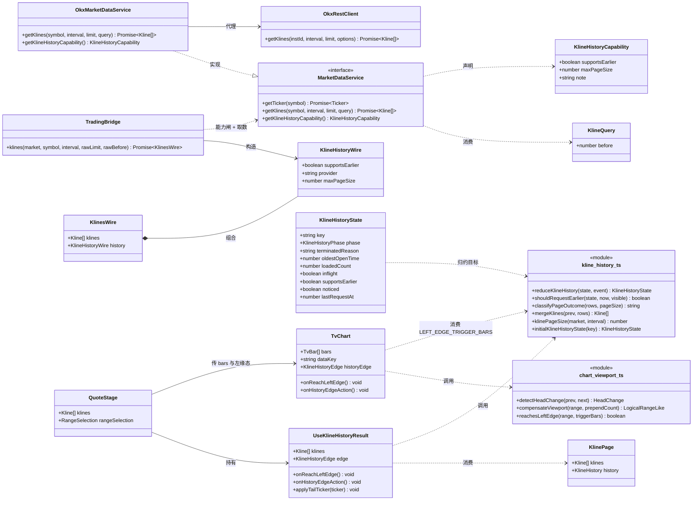
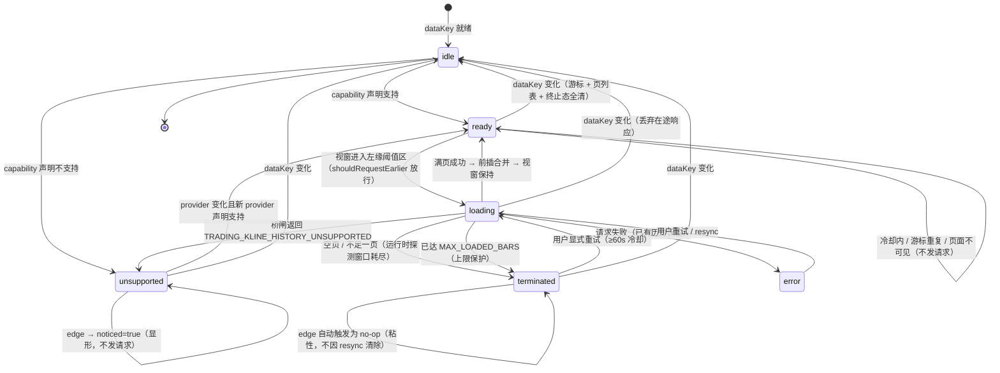
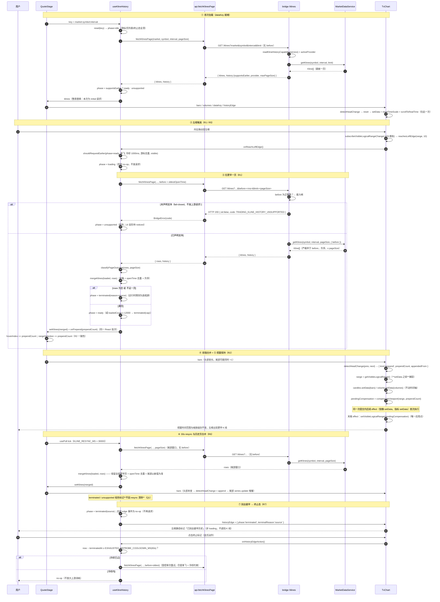
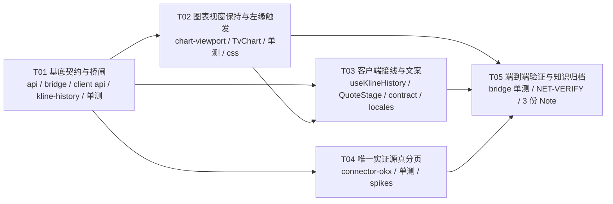

# 系统架构设计：中栏行情图左缘惰性历史分页（`dsh_tv_history_paging`）

| 项 | 内容 |
| --- | --- |
| 文档 | 架构设计 + 任务分解（Part A / Part B 合一） |
| 产出人 | 高见远（架构师） |
| 日期 | 2026-09-19 |
| 上游输入 | `01-prd.md`（PRD）、`AGENTS.md`（项目契约）、`.agents/notes/README.md`（Agent Note 规则）、`.agents/notes/implemented/architecture/2026-08-30-middle-stage-tradingview-views.md`（Owning Note） |
| 关联任务 | `#2 系统架构设计 + 任务分解` |
| 交付边界 | **本文档是本次唯一新增文件**。未修改任何仓库源码（只读探索）。按 `AGENTS.md`「不授权发布/提交」纪律，未创建 `docs/*.mermaid` 等仓库内文件；Mermaid 源码内联于本文件 §4 与 §2.4 |

---

## 0. 需求锚点与两条已确认决策（复述，不重开）

| 项 | 内容 |
| --- | --- |
| 根因（不推翻） | 向左拖到头 = 「数据只有那么多根」+「取数接口无往早翻页能力」。非纯前端交互缺陷 |
| 决策 D1 | 覆盖 **全部市场**，按**数据源原生分页能力渐进**：有游标做真分页；没有的降级为固定条数并 **UI 明示**，**不得静默假装支持** |
| 决策 D2 | 加载方式 = **左缘惰性分页**（滚到左缘自动续拉更早一页，**视窗不跳动**）。不做「加载全部」按钮，不做一次性全量拉取 |
| 主理人裁决 Q1–Q10 | Q1 终止标记按 `dataKey` 记忆、不因 resync 清除，但留受控重试；Q2 双轨（**显式声明供 UI 提前示明 + 运行时耗尽探测为最终真相源**）；Q3 逐源实证，无法实证一律降级；Q4 页大小 ≤ `MAX_KLINE_LIMIT`=1000；Q5 不做淘汰但须给成本评估与上限保护；Q6 必须有阈值与冷却；Q7 本次不改 `packages/indicators`，须给量级说明；Q8 按 provider 能力驱动不硬编码市场；Q9 词典键位 + 中英双语；Q10 resync 取数条数与页大小**同一口径** |

### 0.1 两条关键事实（PM 发现，已核实并纳入设计骨架）

1. **能力是 provider 级属性，不是市场级属性**。provider 路由可切换，桥层每请求经注册表解析（`bridge.ts:158-164`：`getMarketService` registry-first、`activeProvider` 优先报注册项 provider）。按市场硬编码会出现「支持却报不支持」。
2. **左缘事件挂载点已存在**：`TvChart.tsx:429` 已有 `chart.timeScale().subscribeVisibleLogicalRangeChange(syncRefPrice)`；`dataKey = market:symbol:interval`（`QuoteStage.tsx:1175`）已有「变化即全量重置」语义。两者合起来 = 免费的分页触发源 + 天然的游标重置锚点，本次**不新引入任何时间轴订阅**。

---

# Part A · 系统设计

## 1. 实现方案总览与技术选型

### 1.1 核心技术难点

| # | 难点 | 本质 | 本设计的应对 |
| --- | --- | --- | --- |
| H1 | **接口层无往早游标** | `MarketDataService.getKlines` 只有 `limit`（`packages/api/src/index.ts:555`） | 在 **base（`packages/api`）** 加**可选**第 4 参 `query?: KlineQuery`（`before` 游标）。加可选参数 = 全部既有实现方与调用方零改动（TS 允许实现方形参少于接口） |
| H2 | **前插数据会让视窗跳动** | `TvChart.tsx:519-525` 的判定用 `firstTimeDiffers()` 识别「头部变化」→ 走 `setData + resetTimeScale() + scrollToRealTime()`，正是 R2 禁止的行为 | 把「头部变化」细分为 `reset / prepend / append` 三类；仅 `reset` 走原路径，`prepend` 走 **逻辑下标补偿**（见 §5） |
| H3 | **不支持 vs 已到最早，两种终止必须可分辨** | 前者是能力缺失（不该发请求），后者是运行时窗口耗尽（已发到尽头） | **三态可分辨的返回语义**：声明不支持 → 桥层 fail-closed 抛 `TRADING_KLINE_HISTORY_UNSUPPORTED`；请求成功但短页/空页 → 运行时判定 `terminated(source)` |
| H4 | **resync 会吞掉已加载早期页** | 现 `setKlines(rows)` 是**整表替换**（`QuoteStage.tsx:330-332`），替换即丢弃更早页并产生 reset 路径 | 取数结果统一走 `mergeKlines()`（并集 + 按 `openTime` 去重 + 升序，重叠以新响应为准）；resync 职责收窄为**尾部窗口合并** |
| H5 | **快速拖动的请求风暴** | 左缘事件在拖动中高频触发 | 四重闸：单飞 + 冷却 1000ms + 游标精确去重 + 粘性终止态 + 页面不可见不发（`document.visibilityState`） |
| H6 | **前插会打歪既有逻辑下标状态** | `rangeSelection`（框选区间）、`hoverIndex` 都是**逻辑下标**，前插 k 根后全部失效 | 前插与这些 state 的位移在**同一 React 批次**内完成（见 §5.4），保证不出现「一帧陈旧高亮」 |

### 1.2 三层切分及其理由

```
┌─ Connector 层（packages/connector-*） ────────────────────────────┐
│ 能力来源。getKlineHistoryCapability() 显式声明 + getKlines(…,query) │
│ 真实现。声明是 UI 提前示明的依据，不是终判。                        │
└───────────────┬──────────────────────────────────────────────────┘
                │ 契约在 packages/api（base，市场无关）
┌───────────────▼──────────────────────────────────────────────────┐
│ Bridge 层（packages/client-ui-trading/src/bridge.ts）              │
│ ① 协议校验（before 为正整数 epoch ms）② 能力闸：未声明支持 → 拒绝  │
│ ③ 每响应回带 history{provider,supportsEarlier,maxPageSize}        │
└───────────────┬──────────────────────────────────────────────────┘
                │ HTTP /dshtrading/api/klines
┌───────────────▼──────────────────────────────────────────────────┐
│ Client 层（client-ui-trading/src/client/）                         │
│ 纯逻辑：kline-history.ts（状态机/合并/常量）                       │
│        chart-viewport.ts（前插判定 + 视窗补偿，纯函数）             │
│ 接线：useKlineHistory.ts（hook）· QuoteStage.tsx · TvChart.tsx      │
└──────────────────────────────────────────────────────────────────┘
```

**为何这样切（三条硬理由）**

| 理由 | 说明 |
| --- | --- |
| R1 · 契约必须落 base | `AGENTS.md`：**bundle patch insert-only，base 拥有全部市场无关行**。往早游标是市场无关语义，只能进 `packages/api`；在各市场 bundle 里各写一份会立刻分叉 |
| R2 · 能力闸必须在桥层 | 桥是**唯一**知道「当前激活 provider 是谁」的地方（`activeProvider`，`bridge.ts:164`）。把能力闸放连接器 = 连接器不知道自己是否被路由选中；放客户端 = 客户端看不到 provider。桥层是唯一正确的收口点，同时天然满足 Q8（按 provider 驱动，任何市场只要 provider 支持就自动获得该能力） |
| R3 · 视窗补偿必须在渲染层 | 只有 `TvChart` 持有 `IChartApi`。把补偿放到 QuoteStage 会引入「父级驱动子级图表 API」的反向依赖；放到 TvChart 内则是纯局部闭环，且可把**纯数学部分**抽成 `chart-viewport.ts` 做零 canvas 单测 |

### 1.3 技术选型

| 选型 | 结论 | 依据 |
| --- | --- | --- |
| 视窗保持 API | **`ITimeScaleApi.setVisibleLogicalRange(range)`**（lightweight-charts 5.2.1，`node_modules/.pnpm/lightweight-charts@5.2.1/node_modules/lightweight-charts/dist/typings.d.ts:2910`） | 官方文档明确「若你能自行近似索引，请用 `setVisibleLogicalRange`」；前插场景下标位移量是**精确已知**的 `prependCount`，无需任何估算 |
| 左缘触发 | 复用既有 `subscribeVisibleLogicalRangeChange`（`TvChart.tsx:429`） | PRD §2.2 已核实；零新订阅、零新生命周期 |
| 分页请求节律 | 事件驱动（非 `usePoll`）+ `document.visibilityState` 门 | 分页由用户手势驱动，本就不该用轮询钩子；隐藏页不发请求沿用 `usePoll` 同款礼仪 |
| 状态机 | 纯函数 `reduce(state, event)` | 可零 mock 单测（项目测试棘轮要求），且状态转移可枚举验证 |
| 依赖 | **零新增第三方包** | 见 §8 |
| 文案 | 沿用既有 `MarketLocaleKey` 编译期键位校验 + `locales.ts` zh/en 双记录 | 项目既有机制（`contract.ts:12`、`scripts/i18n-audit.mjs`） |

### 1.4 本次交付边界（必须明示给用户，避免夸大）

| 源类别 | 本次行为 |
| --- | --- |
| **声明支持往早翻页的连接器** | 真分页（本次 = connector-okx，见 §3） |
| 其余全部连接器 | **降级**：仍取固定条数（现有口径不变），左缘出现「该数据源不支持更早历史」提示。**不伪造、不插值、不静默假装** |
| `spikes/` 实证候选 | binance / tencent / eastmoney（结构上具备时间窗，源码有据、**上游行为未实证**）→ 见 §3.4 的升级清单；**未拿到网络原始响应证据前一律不写死支持** |

---

## 2. 接口与数据结构

### 2.1 `packages/api/src/index.ts`（base，唯一的契约家）

```ts
/**
 * K 线查询选项（可选第 4 参）。缺席 = 现有「取最新一页」语义——旧调用与旧实现方
 * 零改动（TS 允许实现方形参少于接口）。
 */
export interface KlineQuery {
  /**
   * 取「openTime **严格早于** before」的 K 线（epoch ms，与 Kline.openTime 同口径，
   * 不做秒/毫秒换算），返回仍为**时间升序、最多 limit 根**。用于图表左缘往更早翻页。
   *
   * 契约纪律（防静默假装支持）：**不支持该语义的实现方必须抛
   * `TRADING_NOT_IMPLEMENTED`**，不得忽略该参数返回最新页——否则调用方会把重复
   * 数据当成更早历史。此纪律由桥层能力闸二次加固（见 §2.2），连接器侧是兜底。
   */
  readonly before?: number
}

/**
 * 往更早时间翻页的能力声明（可选方法；**缺席 = 未声明 = 消费方按「不支持」处置**）。
 *
 * 双轨分工（避免能力表与上游真实行为漂移）：
 * - 本声明用于 UI **提前** 示明「该源不支持更早历史」，省掉一次注定失败的上游往返；
 * - **耗尽（已到最早）** 一律由**运行时探测**裁决：请求更早一页返回空 / 不足一页，
 *   即判定该源窗口耗尽。运行时是终止态的**最终真相源**。
 */
export interface KlineHistoryCapability {
  /** 是否具备「按时间游标往更早翻页」能力。 */
  readonly supportsEarlier: boolean
  /** 单请求最大条数（分页页大小上限）；缺省 = 由桥 MAX_KLINE_LIMIT 约束。 */
  readonly maxPageSize?: number
  /** 能力依据（人类可读，供日志/Agent 排查；UI 不展示）。 */
  readonly note?: string
}
```

`MarketDataService` 变更（`packages/api/src/index.ts:553-596`）：

```ts
export interface MarketDataService {
  getTicker(symbol: string): Promise<Ticker>
  // ← 唯一改动：追加可选第 4 参
  getKlines(symbol: string, interval: Interval, limit?: number, query?: KlineQuery): Promise<Kline[]>
  subscribeTicker(symbol: string, cb: (ticker: Ticker) => void): Disposable
  listInstruments?(): Promise<Array<{ symbol: string; name?: string }>>
  getFundamentals?(symbol: string): Promise<StockFundamentals>
  getDerivatives?(symbol: string): Promise<DerivativesData>
  getDerivativesHistory?(symbol: string): Promise<DerivativesHistory>
  getOrderbook?(symbol: string): Promise<Orderbook>
  getRecentTrades?(symbol: string, limit?: number): Promise<TradeTick[]>
  // ← 新增可选方法（与 listInstruments/getFundamentals 同族的可选能力面先例）
  getKlineHistoryCapability?(): KlineHistoryCapability
}
```

**向后兼容性论证**

| 消费方 | 现状调用 | 改后 |
| --- | --- | --- |
| `packages/indicators/src/tool.ts:52` 起 | 3 参 | 编译/运行均不变（第 4 参可选） |
| `packages/base/src/research-tools.ts:45` | 3 参 | 不变 |
| `packages/strategies/src/plugin.ts:479,1225` | 3 参 | 不变 |
| 各连接器 `index.ts` 的代理方法 | 3 参 | 不变（形参少 = 合法实现） |
| `connector-template` 生成器 | 3 参 | 不变；建议在模板注释里提示可选能力面 |

### 2.2 `packages/client-ui-trading/src/bridge.ts`

```ts
/** 往早翻页能力（随 /klines 响应**始终**回带；provider 切换后下一次取数即刷新）。 */
export interface KlineHistoryWire {
  supportsEarlier: boolean
  /** 当前激活 provider slug（undefined = 路由未裁决，客户端按 supportsEarlier=false 处置）。 */
  provider?: string
  maxPageSize?: number
}

export interface KlinesWire {
  klines: Kline[]
  history: KlineHistoryWire   // ← 新增且恒存在：客户端首次取数即知能力，无需额外往返
}
```

桥方法签名与语义（替换 `bridge.ts:661-673`）：

```ts
async klines(
  market: string,
  symbol: string,
  interval: string,
  rawLimit: string | null,
  rawBefore: string | null,        // ← 新增
): Promise<KlinesWire>
```

处理顺序（**顺序即安全语义**）：

```ts
// ① 市场/符号/limit 校验（沿用现状，limit ∈ 1..MAX_KLINE_LIMIT=1000）
// ② before 协议校验
const before = rawBefore === null || rawBefore === undefined ? undefined : Number(rawBefore)
if (before !== undefined && (!Number.isInteger(before) || before <= 0)) {
  throw new BridgeProtocolError(400, 'klines: before must be a positive integer (epoch ms)')
}
// ③ 能力解析（fail-closed：异常 / 非对象 / 未声明 → 不支持）
const capability = readKlineHistoryCapability(service)
// ④ 能力闸：不允许把 before 透传给未声明支持的实现方（否则会拿到重复数据）
const provider = this.host.activeProvider(market as MarketId)
if (before !== undefined && !capability.supportsEarlier) {
  throw Object.assign(
    new Error(`kline history paging unsupported by ${provider ?? market}`),
    { code: 'TRADING_KLINE_HISTORY_UNSUPPORTED' },
  )
}
// ⑤ 取数
const klines = await service.getKlines(trimmed, interval as Interval, limit,
  before === undefined ? undefined : { before })
return {
  klines,
  history: {
    supportsEarlier: capability.supportsEarlier,
    ...(provider !== undefined ? { provider } : {}),
    ...(capability.maxPageSize !== undefined ? { maxPageSize: capability.maxPageSize } : {}),
  },
}
```

```ts
/** 能力读取（鸭式 + fail-closed）：任何异常一律视作「不支持」，绝不向上抛。 */
function readKlineHistoryCapability(service: MarketDataService): KlineHistoryCapability {
  const fn = service.getKlineHistoryCapability
  if (typeof fn !== 'function') return { supportsEarlier: false }
  try {
    const declared: unknown = fn.call(service)
    return declared !== null && typeof declared === 'object'
      && (declared as KlineHistoryCapability).supportsEarlier === true
      ? (declared as KlineHistoryCapability)
      : { supportsEarlier: false }
  } catch {
    return { supportsEarlier: false }
  }
}
```

路由（`bridge.ts:1908-1913`）：新增 `const before = search.get('before')` 并透传。

**为何用业务错误信封而不是「返回空数组」**：空数组会被客户端误读成「已到最早」（EXHAUSTED），而「不支持」是**能力缺失**，两者必须可分辨（H3 / R3 / R7）。用既有信封（HTTP 200 + `{ok:false, code, message}`，见 `api.ts:31-36` 注释所述约定）→ 客户端 `getJson` 转成 `BridgeError.code`，状态机据此进 `unsupported`。

### 2.3 `packages/client-ui-trading/src/client/api.ts`

**红线：不得改 `fetchKlines` 的返回类型。** 它是跨包 face 契约（`api.ts:1054` `fetchKlines: typeof fetchKlines`），已有 6 个外部调用点：`MarketSidebar.tsx:248,268,284`、`client-ui-strategies/src/client/ScreenerPane.tsx:314`、`StrategyView.tsx:280`、`index.ts:66`。改返回类型会连带改一个**独立 bundle 包**——违背最小改动与 insert-only 精神。

```ts
export interface KlineHistory {
  supportsEarlier: boolean
  provider?: string
  maxPageSize?: number
}

export interface KlinePage {
  klines: Kline[]
  history: KlineHistory
}

/** 新增：带往早游标与能力元数据的取数（本包内部使用，不进 TradingBridgeService 面）。 */
export async function fetchKlinesPage(
  market: MarketId, symbol: string, interval: string, limit: number, before?: number,
): Promise<KlinePage>

/** **签名与返回类型保持不变**（跨包 face 契约）：尾部窗口 K 线。 */
export async function fetchKlines(
  market: MarketId, symbol: string, interval: string, limit: number,
): Promise<Kline[]> {
  return (await fetchKlinesPage(market, symbol, interval, limit)).klines
}
```

### 2.4 客户端纯逻辑（两个新模块）

`packages/client-ui-trading/src/client/kline-history.ts`（分页领域；零 React、零 DOM）

```ts
/* ── 常量：全部数字的唯一家（一个数字只有一个家）────────────────── */
export const KLINE_PAGE_SIZE_DEFAULT = 500        // 非 crypto 盘中周期
export const KLINE_PAGE_SIZE_BY_MARKET: Partial<Record<MarketId, number>> = { crypto: 300 }
export const KLINE_PAGE_SIZE_DAILY = 750          // ≈ 三年交易日
export const MAX_LOADED_BARS = 12000              // 会话内已加载根数硬上限（Q5 保护）
export const LEFT_EDGE_TRIGGER_BARS = 10          // 左缘触发阈值（逻辑根数）
export const PAGE_REQUEST_COOLDOWN_MS = 1000      // 分页请求冷却
export const EXHAUSTED_REPROBE_COOLDOWN_MS = 60000 // 终止后受控重试冷却

/** 页大小：分页请求与 30s resync **共用同一函数**（Q10 同一口径，杜绝两套数字漂移） */
export function klinePageSize(market: MarketId, interval: string): number
/** dataKey（= 分页游标重置锚点，与 TvChartProps.dataKey 同构） */
export function klineHistoryKey(market: MarketId, symbol: string, interval: string): string

/* ── 状态机 ─────────────────────────────────────────────────────── */
export type KlineHistoryPhase =
  | 'idle'         // 首屏尚未拿到能力（不渲染任何左缘元素）
  | 'ready'        // 可翻页 · 空闲
  | 'loading'      // 加载中（R8）
  | 'terminated'   // 终止（R7）
  | 'unsupported'  // 当前源不支持（R3）
  | 'error'        // 失败可重试（R11）

export interface KlineHistoryState {
  readonly key: string
  readonly phase: KlineHistoryPhase
  /** terminated 的成因：source = 数据源窗口耗尽；cap = 会话上限保护 */
  readonly terminatedReason?: 'source' | 'cap'
  readonly failureCode?: string
  readonly oldestOpenTime?: number
  readonly loadedCount: number
  readonly inflight: boolean
  readonly supportsEarlier: boolean
  readonly provider?: string
  readonly noticed: boolean            // 用户是否已真正拖到过左缘（unsupported 的显形门）
  readonly lastRequestAt: number
  readonly lastRequestedCursor?: number
  readonly terminatedAt?: number
}

export type KlineHistoryEvent =
  | { type: 'reset'; key: string }
  | { type: 'capability'; key: string; supportsEarlier: boolean; provider?: string }
  | { type: 'edge' }
  | { type: 'requestStarted'; cursor: number; at: number }
  | { type: 'pageOk'; rows: readonly Kline[]; pageSize: number; at: number }
  | { type: 'pageTerminated'; reason: 'source' | 'cap'; at: number }
  | { type: 'pageFailed'; code?: string; at: number }
  | { type: 'reprobe'; at: number }

export function initialKlineHistoryState(key: string): KlineHistoryState
export function reduceKlineHistory(s: KlineHistoryState, e: KlineHistoryEvent): KlineHistoryState
/** 单一请求放行判据：phase/单飞/冷却/游标去重/页面可见。 */
export function shouldRequestEarlier(s: KlineHistoryState, now: number, visible: boolean): boolean
/** 页面结果判据：不足一页 ⇒ 数据源窗口耗尽（运行时探测 = 终止态真相源）。 */
export function classifyPageOutcome(rows: readonly Kline[], pageSize: number): 'page' | 'exhausted'
/** 并集 + 按 openTime 去重 + 升序；重叠以「新响应」为准（resync 修订开高低/量）。 */
export function mergeKlines(prev: readonly Kline[], rows: readonly Kline[]): Kline[]
```

`packages/client-ui-trading/src/client/chart-viewport.ts`（图表视窗；零 canvas、零 lightweight-charts import）

```ts
export interface TimePoint { readonly time: number }
export interface LogicalRangeLike { readonly from: number; readonly to: number }

export type HeadChange =
  | { kind: 'reset' }
  | { kind: 'append'; appendedFrom: number }
  | { kind: 'prepend'; prependCount: number; appendedFrom: number }

/** 新序列相对旧序列的头部变化。判定完全基于 time，不依赖长度差（长度差含尾部增量，会算错）。 */
export function detectHeadChange(prev: readonly TimePoint[], next: readonly TimePoint[]): HeadChange
/** 视窗保持：逻辑下标整体平移 prependCount，区间宽度（= 缩放级别）不变。 */
export function compensateViewport(range: LogicalRangeLike, prependCount: number): LogicalRangeLike
/** 左缘判定。 */
export function reachesLeftEdge(range: LogicalRangeLike | null, triggerBars: number): boolean
```

### 2.5 类图



### 2.6 状态机（转移表 + 图）

| 当前态 | 事件 | 次态 | 副作用（hook 侧） |
| --- | --- | --- | --- |
| `idle` | `capability{supportsEarlier:true}` | `ready` | — |
| `idle` | `capability{supportsEarlier:false}` | `unsupported` | — |
| `ready` | `edge` | `loading` | 发起分页请求（`before = oldestOpenTime`） |
| `ready` | `edge`（冷却内/游标重复/不可见） | `ready` | **不发请求**（R5） |
| `loading` | `pageOk`（满页） | `ready` | `mergeKlines` 前插 + 通知 `onPrepend` |
| `loading` | `pageTerminated{source}` | `terminated(source)` | 先合并本页（若非空） |
| `loading` | `pageOk` 后 `loadedCount ≥ MAX_LOADED_BARS` | `terminated(cap)` | 合并但**停止继续往早** |
| `loading` | `pageFailed{TRADING_KLINE_HISTORY_UNSUPPORTED}` | `unsupported` | 粘性 |
| `loading` | `pageFailed{其它}` | `error` | 已有历史保留（R11） |
| `error` | `edge` / `onHistoryEdgeAction` / resync | `loading` | 重试（冷却门） |
| `terminated(*)` | `edge`（自动） | `terminated(*)` | **不发请求**（不因 resync 清除，Q1） |
| `terminated(*)` | `reprobe`（用户显式，且距 `terminatedAt` ≥ 60s） | `loading` | 受控单次重试（Q1「保留受控重试机会」） |
| `unsupported` | `edge` | `unsupported` + `noticed=true` | 显形提示，**不发请求** |
| 任意态 | `capability`（provider 或 supportsEarlier 变化） | 重新判定 | 清 `terminated`/`unsupported` 粘性（R3③ 切 provider 正确刷新） |
| 任意态 | `reset{key}` | `idle` | 游标/页列表/终止态全清（R4） |



> 与 PRD §5.2 的差异仅两处（均为本文档新增、且不违背 PRD）：① `unsupported` 增加 `noticed` 显形门（落实 §5.4「首次触发时出现一次」）；② 终止态细分为 `source`/`cap` 两个成因（落实 Q5 的上限保护）。

---

## 3. 各 provider 分页能力核实表（Q3 交付物）

**核实方法**：逐源精读本仓源码（`file:line`），凡源码中**实际使用**的时间参数即记「现形」；凡上游协议可能支持但本仓未使用、且无 `spikes/` 原始响应证据的，一律记**待实证**，不得据猜测写死支持。

| # | provider | 市场 | 源码证据（`file:line`） | 现形时间参数 | 分页能力结论 | 本次落地 |
| --- | --- | --- | --- | --- | --- | --- |
| 1 | **okx** | crypto | `connector-okx/src/rest.ts:538-587`：单请求 ≤300（`:553`），`after` 游标（`:555`），短页即窗口耗尽即停（`:581`），跨页 `openTime` 去重（`:577`），总量 1..1000（`:542`）；`:546-548` 注释明示 `after` = 严格早于该 ts，且 candles 可回看深度随 bar 档位（日线约 1440 根） | `after`（**已用**） | **✅ 支持** | **真分页** |
| 2 | **binance** | crypto（默认） | `connector-binance/src/rest.ts:291-304`：`/api/v3/klines` 仅 `symbol/interval/limit`（`:299`）；`limit ≤ 1000`（`:296`） | 无 | **⚠ 待实证**（上游 `startTime/endTime` 本仓未用，源码无据） | 降级提示 |
| 3 | **bybit** | crypto | `connector-bybit/src/rest.ts:157-186`：`/v5/market/kline?category&symbol&interval&limit`（`:167`） | 无 | **⚠ 待实证**（上游 `start/end` 未用） | 降级 |
| 4 | **ccxt** | crypto | `connector-ccxt/src/rest.ts:125-139`：实打 `https://api.binance.com/api/v3/klines`，仅 `limit`（`:127`）；形参 `exchange` 未参与 URL | 无 | **⚠ 待实证** | 降级 |
| 5 | **yahoo** | us（默认） | `connector-yahoo/src/rest.ts:208-267`：`interval` + `range` 档位（`:217-219`）；`getKlines` 全窗口拉取（`:270-278`）；服务层按 `limit` 截尾（`index.ts:83-87` `all.slice(-limit)`） | 无（仅 relative range） | **❌ 现形不支持**；上游 `period1/period2` **待实证** | 降级 |
| 6 | **alpaca** | us | `connector-alpaca/src/rest.ts:202-227`：`/stocks/bars?symbols&timeframe&limit&feed&adjustment`（`:209`） | 无 | **❌ 现形不支持**（上游 `start/end` 未用） | 降级 |
| 7 | **fmp** | us | `connector-fmp/src/rest.ts:126-149`：分钟 `/historical-chart/{int}/{sym}` 无任何 limit/时间参数（`:129`）；日线 `timeseries={limit}`（`:148`） | 无 | **❌ 现形不支持** | 降级 |
| 8 | **finnhub** | us | `connector-finnhub/src/rest.ts:122-137`：`from = now − limit*step*2`、`to = now`（`:126-127`），URL 已带 `from/to`（`:137`） | `from/to`（**已用**，相对 now） | **⚠ 待实证**（结构上具备时间窗，`to` 作游标未验证） | 降级 |
| 9 | **polygon** | us | `connector-polygon/src/rest.ts:133-149`：`/v2/aggs/ticker/{sym}/range/{mult}/{ts}/{from}/{to}?limit&sort=asc`，`to` 已用（`:137-138`、`:149`） | `from/to`（**已用**，相对 now） | **⚠ 待实证**（结构性具备日期窗） | 降级 |
| 10 | **ibkr** | us | `connector-ibkr/src/rest.ts:104-120`：`/hmds/history?symbol&period={limit}d&bar={interval}`（`:108`）；回退 yahoo `range=1mo`（`:123`） | 仅相对 `period` | **❌ 现形不支持**（上游 `endTime` 未用、待实证） | 降级 |
| 11 | **stooq** | us | `connector-stooq/src/index.ts:83`（未精读 URL 构造） | — | **⚠ 未取证** | 降级 |
| 12 | **tencent** | cn / hk（默认） | `connector-tencent/src/rest.ts:583-603`：`fqkline` URL 模板 `param=${wire},${tf},,,${count},qfq` —— **两个空的 start/end 日期槽位**（`:603`）；`count ≤ 800`（`:598`）；`mkline` 端点无日期槽（`:602`） | 模板有空位，**未传值** | **⚠ 待实证**（结构上具备日期窗；PRD 明确「URL 模板含空位，不可臆断语义」） | 降级 |
| 13 | **eastmoney** | cn / hk | `connector-eastmoney/src/rest.ts:244-291`：`kline/get?...&lmt={limit}&end=20500101`（`:253`）—— **日期上界已硬编码为 20500101** | `end`（已硬编码） | **⚠ 待实证**（结构性具备日期窗，翻页行为未验证） | 降级 |
| 14 | **akshare** | cn | `connector-akshare/src/rest.ts:95-108`：复用东财端点但 URL **无** `end` 参数（`:98`） | 无 | **❌ 现形不支持** | 降级 |
| 15 | **tushare** | cn | `connector-tushare/src/rest.ts:161-190`：`stk_mins` 仅传 `ts_code/freq/fields`（`:175`），未传 `start_date/end_date` | 无 | **⚠ 待实证**（上游 `daily` 支持日期参数，未用） | 降级 |
| 16 | **qmt** | cn | `connector-qmt/src/rest.ts:115`（未精读 URL 构造） | — | **⚠ 未取证** | 降级 |
| 17 | **hithink** | cn / futures | `connector-hithink/src/rest.ts:107`、`connector-hithink/src/futures.ts:107`（未精读） | — | **⚠ 未取证** | 降级 |
| 18 | **futu** | hk / us | `connector-futu/src/rest.ts:203-236`：`/api/qot/get-kl` 仅 `security/klType/reqNum/rehabType`（`:214-219`） | 无 | **❌ 现形不支持** | 降级 |
| 19 | **longbridge** | hk | `connector-longbridge/src/rest.ts:184`（未精读） | — | **⚠ 未取证** | 降级 |
| 20 | **tiger** | hk / us | `connector-tiger/src/rest.ts:147-171`：`kline_quote` 传 `{symbols, period, limit}`（`:153`）；回退腾讯 `hkfqkline/get?param=...,,,${limit},qfq`（`:169`，同 tencent 的空槽模板） | 无（回退路径有槽位） | **❌ 现形不支持**（回退路径待实证） | 降级 |
| 21 | **jin10** | global | `connector-jin10/src/market-data.ts:141-147`：内部 feed 已用 `getKlines(symbol, { time, count })`（`:124`）——**具备 time 参数**；对外只暴露 `limit`（`:146-147` 反推窗口） | `time`（内部已用） | **⚠ 待实证** | 降级 |
| 22 | **template** | — | `connector-template/src/rest.ts:166-170`（生成器模板，供新连接器复制） | 无 | **❌ 现形不支持** | 降级（模板加注释提示可选能力面） |

### 3.1 统计（Q3 交付结论）

| 结论 | 数量 | 明细 |
| --- | --- | --- |
| ✅ **支持**（含源码证据，本次真分页） | **1** | okx |
| ❌ **现形不支持**（源码可证：请求未使用任何绝对时间参数） | **8** | yahoo、alpaca、fmp、ibkr、akshare、futu、tiger、template |
| ⚠ **待实证**（源码有结构线索/未精读，须 `spikes/` 网络原始响应证据方可升级） | **13** | binance、bybit、ccxt、finnhub、polygon、stooq、tencent、eastmoney、tushare、qmt、hithink、longbridge、jin10 |
| 合计 | **22** | — |

> 口径说明：❌ 与 ⚠ 在**本次交付行为上完全一致**（均为「降级 + UI 明示」）；区别只在证据强度与下一步优先级——❌ 需先证明上游有可用参数才谈实现，⚠ 已看到结构线索，优先做 spike。

### 3.2 运行时耗尽探测在哪些源上生效

| 场景 | 行为 |
| --- | --- |
| 声明支持 + 运行时短页/空页（**okx 常态**） | → `terminated(source)`，UI「已到达最早历史」 |
| 声明支持 + 运行时持续满页 | → 继续翻，直至短页或撞 `MAX_LOADED_BARS` |
| 未声明 / 声明不支持 | 桥层**不发上游请求**直接拒绝 → `unsupported`，UI「该数据源不支持更早历史」 |

`after` 语义与 `before` 契约**逐字同构**（均严格早于），这是 okx 零摩擦落地的依据（`connector-okx/src/rest.ts:546-548`）。

### 3.3 okx 具体实现（唯一真分页源）

```ts
// connector-okx/src/rest.ts —— 只加一个可选 4 参，循环体一字不改
async getKlines(
  instId: string, interval: Interval, limit = 100,
  options?: { before?: number },
): Promise<Kline[]> {
  // …原校验…
  // 唯一改动：游标种子 = options.before（OKX after 语义「严格早于该 ts」与
  // KlineQuery.before 逐字同构，无需任何换算）。
  let cursor: number | undefined = options?.before
  // …原 while 循环、去重、不足一页即停、reverse() 全部不变…
}
```

```ts
// connector-okx/src/index.ts
getKlines(symbol, interval, limit?, query?) {
  return this.client.getKlines(symbol, interval, limit, query)   // 透传
}
getKlineHistoryCapability() {
  return {
    supportsEarlier: true,
    maxPageSize: 300,   // 与 :553 的 Math.min(…, 300) 同源
    note: 'GET /api/v5/market/candles 的 after 游标（严格早于该 ts）；单请求上限 300；回看深度随 bar 档位（日线约 1440 根），耗尽由运行时短页探测裁决',
  }
}
```

### 3.4 升级清单（下一迭代或本迭代有余力时，按证据驱动）

| 优先级 | provider | 待证假设（可falsify） | 升级所需证据 | 预估改动面 |
| --- | --- | --- | --- | --- |
| P1 | **binance** | `/api/v3/klines` 支持 `endTime`（毫秒，闭区间）→ `endTime = before − 1` + `limit` | `spikes/impl-tv-history-paging/net-verify.mjs` 真实两页衔接原始响应 | `connector-binance/rest.ts:291-304` 加可选参 + `index.ts` 声明 |
| P1 | **tencent** | `fqkline` `param=code,tf,start,end,count,qfq` 的 start/end 槽位接受 `YYYY-MM-DD`，`end` = 更早日期即往前翻页 | 同源 spike（沪深 + 港股各一例，含 `qfq` 键回落分支） | `connector-tencent/rest.ts:583-603` |
| P2 | **eastmoney** | `kline/get` 的 `end=YYYYMMDD` 是**含端日期上界**，改成 `oldest − 1 日` 即取更早一页 | spike（A 股 + 港股） | `connector-eastmoney/rest.ts:253` |
| P2 | polygon / finnhub | `to`/`from` 窗口左移即翻页（源码已用相对 now 推导，改绝对游标） | spike | 各一处 URL 构造 |
| P3 | yahoo / alpaca / futu / jin10 / tushare | 上游是否有绝对时间参数 | 上游协议文档 + spike | 各一处 |

**纪律**：升级必须**同一变更内**提交 `spikes/impl-tv-history-paging/` 原始响应证据（`AGENTS.md`：连接器需真实网络原始响应证据）。无证据 = 保持降级。

---

## 4. 时序图



---

## 5. 视窗保持的具体算法（体验核心）

### 5.1 为什么原实现必然跳动

`TvChart.tsx:519-525` 的判定：

```ts
if (prev === null || prev.key !== dataKey
  || bars.length < prev.bars.length            // 前插不触发（变长）
  || firstTimeDiffers(prev.bars, bars)) {       // ← 前插**必然**触发（prev[0].time 变了）
  candles.setData(bars); volume.setData(volumes)
  chart.timeScale().resetTimeScale()            // ← 缩放复位
  chart.timeScale().scrollToRealTime()          // ← 视窗跳到最右：R2 直接违规
  return
}
```

前插会让 `firstTimeDiffers()` 返回 true，于是走「全量重置」分支 → `scrollToRealTime()` 把用户视窗甩到最新 K 线。**这不是调参能解决的，必须新增一条分支。**

### 5.2 算法（三步）

```
① 判定（detectHeadChange，纯函数，只看 time 不看长度）
   anchor   = prev[0].time
   offset   = next.findIndex(b => b.time === anchor)
   若 offset <= 0                                        → reset
   若 offset > 0 且 ∀i∈[0,prev.length): next[offset+i].time === prev[i].time
           → prepend，prependCount = offset
              appendedFrom = max(offset + prev.length − 1, 0)
   否则                                                  → reset（数据源改写了历史，fail-safe）

② 捕获（必须在 setData **之前**）
   range = chart.timeScale().getVisibleLogicalRange()      // { from, to } 逻辑下标

③ 应用（在所有 setData **之后**，唯一应用点）
   candles.setData(bars as TvBar[])
   volume.setData(volumes as TvVolume[])
   chart.timeScale().setVisibleLogicalRange(
     compensateViewport(range, prependCount)               // { from+prependCount, to+prependCount }
   )
   绝不调用 resetTimeScale() / scrollToRealTime() / fitContent()
```

### 5.3 用什么 API、按什么量修正——精确论证

| 项 | 结论 | 依据 |
| --- | --- | --- |
| 读 | `chart.timeScale().getVisibleLogicalRange()` | `typings.d.ts:2900`，返回 `LogicalRange \| null` |
| 写 | `chart.timeScale().setVisibleLogicalRange({from, to})` | `typings.d.ts:2910`；官方注释：「若你能自行近似索引，请用 `setVisibleLogicalRange`」——而本场景下标位移是**精确已知**的 |
| **修正量** | **`prependCount`**（= `next` 中 `prev[0].time` 所在的逻辑下标 = **头部新增根数**） | 逻辑下标按时间轴数据顺序计数；头部前插 k 根 ⇒ 所有既有柱的下标整体 **+k** |
| 为何缩放级别不变 | `barSpacing = 绘图区宽 / (to − from)`。`to − from` 未变、绘图区宽未变 ⇒ `barSpacing` 未变 ⇒ 缩放级别不变 | `compensateViewport` 只做平移，**不改变区间宽度**，这是该函数唯一的不变量（单测断言） |
| 为何不会撞 `fixLeftEdge` 钳制 | `fixLeftEdge: true`（`TvChart.tsx:215,272`）限制的是「不能拖出数据左端」；本次是**向左新增数据**，左端更远，钳制更松 | 方向性论证；且 `from + prependCount ≥ 0` 恒成立（`from` 是既有可视起点） |
| 为何不会撞 `fixRightEdge` | 右端数据未动，`to` 只是平移相同量 | 同上 |

### 5.4 三个必须避开的陷阱（工程师必读）

| # | 陷阱 | 正确做法 |
| --- | --- | --- |
| **P1** | **修正量用长度差会算错**：`next.length − prev.length = prependCount + 尾部新增`。resync 常常同时前插一页 + 尾部 +1 根新 K 线 —— 用长度差会多平移 1 根，视窗每次跳动一根 | 修正量**必须**取 `detectHeadChange().prependCount`（= `offset`），**禁止**用 `bars.length − prev.bars.length` |
| **P2** | **补偿被后续 `setData` 覆盖**：同一次提交里，镜像序列（`:597-654` 三个 `setData`）与指标序列（`:657-664` `syncIndicators`）会继续 `setData`。若在蜡烛 effect 内立即补偿，后续 effect 仍可能重算时间轴 | 补偿放到**声明在最末的专用 effect**（在指标 effect 之后），单点应用；`pendingCompensationRef` 由蜡烛 effect 写入、由该 effect 读出并清空 |
| **P3** | **前插打歪既有逻辑下标状态**：`rangeSelection`（框选区间，`QuoteStage.tsx:1185`）与 `hoverIndex` 都是逻辑下标，前插 k 根后整体失效 → 高亮框/读数偏 k 根 | hook 在合并页面的**同一 React 批次**内回调 `onPrepend(prependCount)`；QuoteStage 在同一 handler 内 `setHoverIndex(i => i===null?null:i+count)`、`setRangeSelection(s => s===null?null:{start:s.start+count,end:s.end+count})`。React 18 自动批处理保证不会出现「一帧陈旧高亮」 |
| P4（附带） | 补偿本身会触发 `subscribeVisibleLogicalRangeChange`（程序化变更也回调） | `suppressEdgeRef`：应用补偿前置 true、`setVisibleLogicalRange()` 之后置 false，抑制自触发；即便漏抑制，状态机在 `loading` 态天然 no-op，双保险 |

### 5.5 与 `shiftVisibleRangeOnNewBar` 的关系

`timeScale.shiftVisibleRangeOnNewBar: true`（`TvChart.tsx:217,274`）只在**新 bar 出现在尾部且用户视窗含最后一根**时右移视窗——这是既有、期望的行为（跟最新价）。前插走的是 `setVisibleLogicalRange`，与该项无交互冲突：`prepend` 分支不产生「新 bar 追加到尾部」之外的时序变化，且补偿发生在同一提交的末尾。**不改该配置。**

---

## 6. 文件列表（新增 / 修改，精确路径）

### 6.1 修改（14）

| # | 路径 | 改动要点 |
| --- | --- | --- |
| M1 | `packages/api/src/index.ts` | 新增 `KlineQuery` / `KlineHistoryCapability`；`getKlines` 追加可选第 4 参；新增可选方法 `getKlineHistoryCapability?()` |
| M2 | `packages/client-ui-trading/src/bridge.ts` | `KlineHistoryWire` + `KlinesWire.history`；`klines()` 加 `rawBefore` 形参 + `before` 校验 + 能力闸 + `readKlineHistoryCapability()`；`dispatchBridgeRequest` 的 `/klines` 解析 `before` |
| M3 | `packages/client-ui-trading/src/client/api.ts` | 新增 `KlinePage` / `KlineHistory` / `fetchKlinesPage()`；`fetchKlines()` 改为其薄包装（**返回类型不变**） |
| M4 | `packages/client-ui-trading/src/client/TvChart.tsx` | 新 props `onReachLeftEdge` / `historyEdge` / `onHistoryEdgeAction`；`subscribeVisibleLogicalRangeChange` 回调扩为「参考价同步 + 左缘判定」；蜡烛 effect 三分支（reset/append/prepend）；末尾专用补偿 effect；`suppressEdgeRef`；左缘状态 UI |
| M5 | `packages/client-ui-trading/src/client/QuoteStage.tsx` | 删除本地 `KLINE_LIMIT_DEFAULT/KLINE_LIMIT_BY_MARKET/DAILY_LIMIT`（迁至 `kline-history.ts`）；klines 取数交给 `useKlineHistory`；ticker 尾部合并改走 hook 的 `applyTailTicker`；`hoverIndex`/`rangeSelection` 前插位移；传 `historyEdge` 三 props；`fetchKlines` 两处（`:330`、`:344`）适配新 API |
| M6 | `packages/client-ui-trading/src/client/contract.ts` | `MarketLocaleKey` 新增 `quote.history.*` 键位 |
| M7 | `packages/client-ui-trading/src/client/locales.ts` | 新增键位的 zh / en 双记录 |
| M8 | `packages/client-ui-trading/src/client/quote-stage.module.css` | 左缘状态元素样式（`historyEdge` 系列 class） |
| M9 | `packages/connector-okx/src/rest.ts` | `getKlines` 追加可选 `options?: { before?: number }`，游标种子改为 `options?.before` |
| M10 | `packages/connector-okx/src/index.ts` | 透传第 4 参；新增 `getKlineHistoryCapability()` |
| M11 | `packages/connector-okx/test/public-market-data.test.ts` | 新增 `before` 种子 / 短页即停 / 升序合并用例 |
| M12 | `packages/client-ui-trading/test/bridge.test.ts` | 新增 `/klines` 的 `before` 透传、能力闸拒绝、`history` 回带用例 |
| M13 | `.agents/notes/implemented/feature/2026-09-02-okx-kline-pagination-3y-daily.md` | **原地更新**（Owning Note：OKX 游标 / 桥帽 / 客户端限深） |
| M14 | `.agents/notes/implemented/architecture/2026-08-30-middle-stage-tradingview-views.md` | **原地更新**（Owning Note：中栏 TradingView 视图 + `usePoll` / 30s resync 口径） |

### 6.2 新增（8）

| # | 路径 | 内容 |
| --- | --- | --- |
| N1 | `packages/client-ui-trading/src/client/kline-history.ts` | 分页领域纯逻辑：常量、`klinePageSize`、`klineHistoryKey`、状态机类型、`reduceKlineHistory`、`shouldRequestEarlier`、`classifyPageOutcome`、`mergeKlines` |
| N2 | `packages/client-ui-trading/src/client/chart-viewport.ts` | 图表视窗纯逻辑：`detectHeadChange`、`compensateViewport`、`reachesLeftEdge` |
| N3 | `packages/client-ui-trading/src/client/useKlineHistory.ts` | hook：key 重置、initial/resync/earlier 三类请求、`usePoll(…, KLINE_RESYNC_MS)`、竞态守卫、`onPrepend` 回调、`edge` 视图态 |
| N4 | `packages/client-ui-trading/test/kline-history.test.ts` | 纯逻辑单测（状态机 + 合并 + 放行判据 + 页大小上限） |
| N5 | `packages/client-ui-trading/test/chart-viewport.test.ts` | 纯函数单测（三态判定 + 零位移不变量 + 左缘阈值） |
| N6 | `spikes/impl-tv-history-paging/net-verify.mjs` | 真实网络证据脚本（okx `after` 两页衔接；候选 binance `startTime/endTime`、tencent 日期槽） |
| N7 | `spikes/impl-tv-history-paging/NET-VERIFY.md` | 原始响应 + 交叉一致性说明（沿用 `spikes/impl-a/NET-VERIFY.md` 格式） |
| N8 | `.agents/notes/implemented/feature/2026-09-19-kline-history-lazy-paging.md` | **新建** Agent Note（Owner：游标契约 + 能力声明 + 左缘分页状态机 + 视窗补偿） |

**共 22 个文件。** 未列出的文件（`MarketSidebar.tsx`、`client-ui-strategies/*`、`packages/indicators/*`、`packages/strategies/*`、`packages/base/*`）**零改动**——这是 §2.3 的红线与 §2.1 的可选参数设计共同保证的。

### 6.3 文案词典（Q9 定稿）

| 键位（`dshtrading.market` 命名空间） | zh | en |
| --- | --- | --- |
| `quote.history.loading` | 正在加载更早数据… | Loading earlier data… |
| `quote.history.earliest` | 已到达最早历史 | Earliest history reached |
| `quote.history.unsupported` | 该数据源不支持更早历史 | This data source does not support earlier history |
| `quote.history.failed` | 更早数据加载失败，点击重试 | Failed to load earlier data · Retry |
| `quote.history.capped` | 已达本次会话回溯上限 | Session history limit reached |
| `quote.history.recheck` | 重新检查更早历史 | Recheck earlier history |
| `quote.history.aria` | 图表历史加载状态 | Chart history loading status |

- 全部无 `{placeholder}`，`i18n-audit.mjs` 的键位与占位符对齐门禁天然通过；
- 文案不含预测/建议性表述（C5）；
- `packages/dsh-i18n/src/client/index.ts:20,31` 构建期 `import` 本模块，**无需**在 i18n 包内再改字面量。

---

# Part B · 任务分解

## 7. 依赖包列表

| 结论 | **零新增第三方依赖。** |
| --- | --- |
| 视窗保持 | 复用已内联的 `lightweight-charts@5.2.1` 的 `ITimeScaleApi.setVisibleLogicalRange`（`typings.d.ts:2910`）与既有 `subscribeVisibleLogicalRangeChange`（`typings.d.ts:3011`）——**不新增任何库** |
| 状态机 / 纯逻辑 | 纯 TypeScript，无依赖 |
| UI 提示 | 复用既有 MUI + Tailwind + CSS Module（`quote-stage.module.css`） |
| 体积影响 | 新增约 500 行 TS（含注释）。按本项目 client bundle 内联模型估算：未压缩 ≈ +12KB，gzip ≈ +3~4KB（**估算，须在 `pnpm build` 后用 client.js 实际字节数核对**）。既有基线：`client.js` 356KB / gzip 92KB（Owning Note 记录值） |
| 上游 API 配额 | 分页请求为**用户手势驱动**（非定时轮询），30s resync 的取数条数严格沿用现有口径（crypto 300 / 其他 500 / 日线 750，`klinePageSize`），**每 30s 的上游调用数与今日完全一致**；新增的只有用户拖到左缘时的一次请求（最多 1 次/秒，冷却 1000ms） |
| 内存 | 见 §10 Q5 成本评估 |

## 8. 任务列表（T01–T05，按依赖顺序）

> 硬约束遵守：**恰好 5 个任务**；每任务 ≥3 个相关文件；配置文件与依赖声明不拆分；第一个任务是「基底/基础设施」；任务间**无长线性链**（T02/T03/T04 并行依赖 T01）。

### T01 · 基底契约与桥闸（P0）

| 项 | 内容 |
| --- | --- |
| 依赖 | 无（起点） |
| 源文件 | `packages/api/src/index.ts`（M1）· `packages/client-ui-trading/src/bridge.ts`（M2）· `packages/client-ui-trading/src/client/api.ts`（M3）· `packages/client-ui-trading/src/client/kline-history.ts`（N1）· `packages/client-ui-trading/test/kline-history.test.ts`（N4） |
| 验收点 | ① `pnpm -r build` 全绿（证明 `getKlines` 追加可选参**不破坏**任何既有实现方/调用方）；② `GET /klines?...&before=n` 透传至连接器 `getKlines(…, { before: n })`；③ 未实现/未声明 `getKlineHistoryCapability` 的服务收到 `before` 时，返回 `{ok:false, code:'TRADING_KLINE_HISTORY_UNSUPPORTED'}` 且**未调用**上游 `getKlines`（用假服务断言调用次数为 0）；④ 无 `before` 的正常 `/klines` 响应**恒带** `history`；⑤ `fetchKlines` 的签名与返回类型与改动前**逐字一致**（`client-ui-strategies` / `MarketSidebar` 零改动即编译通过）；⑥ `KLINE_PAGE_SIZE_*` 三档取值均 ≤ `MAX_KLINE_LIMIT`(1000)，且 `klinePageSize` 被 resync 与分页**同一处**调用（存在单一函数出口） |
| 关键风险 | 能力闸写反（把 `before` 透给不支持的实现方）＝静默重复数据。必须写「拒绝时不调用上游」的断言 |

### T02 · 图表视窗保持与左缘触发（P0）

| 项 | 内容 |
| --- | --- |
| 依赖 | T01（常量 `LEFT_EDGE_TRIGGER_BARS` 与 `KlineHistoryEdge` 类型） |
| 源文件 | `packages/client-ui-trading/src/client/chart-viewport.ts`（N2）· `packages/client-ui-trading/src/client/TvChart.tsx`（M4）· `packages/client-ui-trading/test/chart-viewport.test.ts`（N5）· `packages/client-ui-trading/src/client/quote-stage.module.css`（M8） |
| 验收点 | ① `detectHeadChange` 三态用例：纯前插 → `prepend{prependCount=k}`；前插 + 尾部 +1 → `prepend{prependCount=k}`（**不是 k+1**）；头部被改写 → `reset`；② `compensateViewport` 不变量用例：`to − from` 恒定、两端同时 +`prependCount`；③ `reachesLeftEdge`：`from ≤ 10` 为真、`from = 11` 为假、`null` 为假；④ 人工回归（`dsh-trading --profile trading-web`）：在 okx 源码上连续向左拖，**屏幕中央最后一根 K 线的屏幕坐标不变**（R2），无 `fitContent`/右跳；⑤ 左缘状态四态（loading / 已到最早 / 不支持 / 失败）视觉可区分且不遮挡 K 线与价格轴 |
| 关键风险 | **P1（修正量）与 P2（补偿应用点）**，见 §5.4。这是本次体验成败点 |

### T03 · 客户端接线与文案（P0）

| 项 | 内容 |
| --- | --- |
| 依赖 | T01、T02（新 props 名以 T02 落地的签名为准） |
| 源文件 | `packages/client-ui-trading/src/client/useKlineHistory.ts`（N3）· `packages/client-ui-trading/src/client/QuoteStage.tsx`（M5）· `packages/client-ui-trading/src/client/contract.ts`（M6）· `packages/client-ui-trading/src/client/locales.ts`（M7） |
| 验收点 | ① `dataKey`（`market:symbol:interval`）变化 → 游标、页列表、`terminated`/`unsupported` 粘性标记**全部重置**（R4）；② 30s resync 后已加载早期页仍在、数组内 `openTime` 无重复（R6）；③ 快速来回拖动 / 长按左缘：**不产生请求风暴**（单飞 + 1000ms 冷却 + 游标去重可断言）；④ 终止态后不再有任何分页请求，且 resync 不清除终止标记（Q1）；⑤ 切 provider 后能力提示正确刷新（R3③）；⑥ 加载失败不破坏已加载历史，可重试（R11）；⑦ `pnpm i18n-audit`（或 `node scripts/i18n-audit.mjs --check`）通过：zh/en 键位与占位符 1:1 对齐；⑧ `pnpm test:audit` 与 `pnpm coverage:check` 不红 |
| 关键风险 | 前插与 `hoverIndex`/`rangeSelection` 的**同批次位移**（§5.4 P3）。漏做会出现「框选高亮偏 k 根」的隐蔽缺陷 |

### T04 · 唯一实证源真分页 + 网络取证（P0）

| 项 | 内容 |
| --- | --- |
| 依赖 | T01（仅需 `KlineQuery` 契约） |
| 源文件 | `packages/connector-okx/src/rest.ts`（M9）· `packages/connector-okx/src/index.ts`（M10）· `packages/connector-okx/test/public-market-data.test.ts`（M11）· `spikes/impl-tv-history-paging/net-verify.mjs`（N6） |
| 验收点 | ① `spikes` 脚本真实跑通：okx `after` 两页**首尾衔接无重叠、无缺口**（第 2 页最新一根 openTime 严格早于第 1 页最旧一根），原始响应落盘；② 连接器单测：`before` 作为首个 `after` 发出（断请求 URL/query）、`limit` 与 `before` 同用、短页即停、返回升序；③ `getKlineHistoryCapability()` 返回 `supportsEarlier: true` + `maxPageSize: 300`；④ **候选源取证（同脚本内顺带）**：binance `endTime`/tencent 日期槽若拿到正向原始响应，记录于 `NET-VERIFY.md` 但**不在本任务内接线**（接线留给下一迭代，避免无证据扩面） |
| 关键风险 | 把「上游文档上说支持」当成证据。**必须**是 `spikes/` 下的原始响应；拿不到就保持降级 |

### T05 · 端到端验证与知识归档（P1）

| 项 | 内容 |
| --- | --- |
| 依赖 | T01、T02、T03、T04 |
| 源文件 | `packages/client-ui-trading/test/bridge.test.ts`（M12）· `spikes/impl-tv-history-paging/NET-VERIFY.md`（N7）· `.agents/notes/implemented/feature/2026-09-19-kline-history-lazy-paging.md`（N8）· `.agents/notes/implemented/feature/2026-09-02-okx-kline-pagination-3y-daily.md`（M13）· `.agents/notes/implemented/architecture/2026-08-30-middle-stage-tradingview-views.md`（M14） |
| 验收点 | ① 桥单测覆盖 `before` 全链路 + 能力闸 + `history` 回带；② 三源三态实测证据：**okx → 连续回溯至该源最早（或 `MAX_LOADED_BARS`）**、**binance → 左缘提示「该数据源不支持更早历史」且无请求**、**切 provider（binance↔okx）后提示正确翻转**；③ Note 三份到位且遵守骨架（新建为 `implemented`：`## Problem` / `## Decision` / `## Alternatives considered` / `## Consequences`；两份原地更新后仍为现在时事实、无规格腔）；④ `pnpm build` + `pnpm test` 全绿 |
| 关键风险 | Note 写成规格腔（Proposal/Plan/Acceptance criteria 禁入 `implemented/`）；`pnpm test:audit` 因新测试不合规而红 |



---

## 9. 共享知识（跨文件约定）

| 领域 | 约定 |
| --- | --- |
| **命名** | 游标参数统一叫 **`before`**（语义：**严格早于**，epoch ms，左开区间）；能力方法统一叫 **`getKlineHistoryCapability`**；错误码 **`TRADING_KLINE_HISTORY_UNSUPPORTED`**（桥闸拒绝）；连接器自身未实现时用既有 **`TRADING_NOT_IMPLEMENTED`** |
| **常量归属** | 页大小 / 阈值 / 冷却 / 上限**只**在 `client/kline-history.ts` 定义并导出。`QuoteStage.tsx` 的本地 `KLINE_LIMIT_DEFAULT/KLINE_LIMIT_BY_MARKET/DAILY_LIMIT`（`:76-80`）**删除并迁名**为 `KLINE_PAGE_SIZE_DEFAULT/KLINE_PAGE_SIZE_BY_MARKET/KLINE_PAGE_SIZE_DAILY`（语义不变）；`TvChart.tsx` 从该模块 `import { LEFT_EDGE_TRIGGER_BARS }`。**一个数字只有一个家** |
| **一数一函数** | `klinePageSize(market, interval)` 是页大小的**唯一出口**，30s resync（尾部窗口）与左缘分页（更早一页）**共用**（Q10 同一口径，杜绝两套数字漂移） |
| **数据形状** | `Kline` 七字段不变；`/klines` 响应新增 `history` 且**恒存在**（含无 `before` 的正常取数），客户端无需额外往返即可获知能力 |
| **单位口径** | `openTime` / `closeTime` / `before` 一律 **epoch ms**（不做秒/毫秒换算）。连接器内部若需秒（OKX 用 ms；Yahoo/FinHub 用秒）在连接器内换算，不外溢 |
| **数组不变量** | 任何交给 lightweight-charts 的数组必须**按 `openTime` 升序且唯一**——由 `mergeKlines()` 单点保证，禁止旁路构造 |
| **跨包红线** | `fetchKlines` 的**签名与返回类型不可变**（`api.ts:1054` face 契约，6 个外部调用点）。新增能力走新函数 `fetchKlinesPage`，**不进** `TradingBridgeService` 面（QuoteStage 同包直接 import） |
| **粘性语义** | `terminated` / `unsupported` **不因 30s resync 清除**；仅由 ①`dataKey` 变化 ②`provider` 或 `supportsEarlier` 变化 ③用户显式 `reprobe`（≥60s 冷却）解除 |
| **双语纪律** | 新增文案必须同时落 zh 与 en（键位前缀 `quote.history.`），并通过 `scripts/i18n-audit.mjs` 键位/占位符对齐门禁（C6） |
| **竞态守卫** | 分页请求沿用既有 `requestRef` 比对模式（`QuoteStage.tsx:324-331`）：换标的后在途响应一律丢弃 |
| **礼仪** | 分页请求**单飞**；`document.visibilityState !== 'visible'` 不发；单次请求冷却 ≥1000ms；终止态后自动触发为 no-op |
| **不造假** | 不支持即明示，禁止为空数据伪造 0 值/插值（`AGENTS.md` 铁律与 R3） |
| **本地化文件不重复维护** | `packages/dsh-i18n` 构建期 `import` 源 `locales.ts`，**不得**在 i18n 包另抄字面量 |

### 9.1 关键常量速查（工程师照抄）

| 常量 | 值 | 归属 | 理由 |
| --- | --- | --- | --- |
| `KLINE_PAGE_SIZE_DEFAULT` | 500 | `kline-history.ts` | 沿用现状（`QuoteStage.tsx:76`） |
| `KLINE_PAGE_SIZE_BY_MARKET.crypto` | 300 | 同上 | 沿用现状（`:77`）——OKX 单请求 300，**300 不触发连接器内部翻页**，30s resync 上游调用数不放大（Owning Note 已定的口径） |
| `KLINE_PAGE_SIZE_DAILY` | 750 | 同上 | 沿用现状（`:80`）≈三年交易日；≤ `MAX_KLINE_LIMIT`(1000) ✔ |
| `MAX_LOADED_BARS` | 12000 | 同上 | 会话上限保护（Q5）：日线 ≈48 年（任何源都给不到），盘中分钟线 ≈8.3 天；超限进 `terminated(cap)`。**不淘汰、保持回溯连续性** |
| `LEFT_EDGE_TRIGGER_BARS` | 10 | 同上 | 逻辑根数阈值，与缩放无关；默认 `barSpacing: 9px` 下 ≈90px 提前量。一页 300~750 根本身就是多个视窗宽度，无需更激进的预取 |
| `PAGE_REQUEST_COOLDOWN_MS` | 1000 | 同上 | 单飞之外的第二道闸：把分页请求速率硬上限锁在 ≤1 req/s |
| `EXHAUSTED_REPROBE_COOLDOWN_MS` | 60000 | 同上 | Q1「受控重试」：终止后自动永不重试，用户显式动作 60s 内最多 1 次 |

---

## 10. 成本评估（Q5 / Q7 交付物）

### 10.1 内存（Q5：不做淘汰，但给评估与上限保护）

| 项 | 估算 |
| --- | --- |
| `Kline` 单根 | 7 个 number + 对象头 ≈ **90~100 B**（V8 估算） |
| `klines` 12000 根 | ≈ **1.2 MB** |
| 派生 `bars`（4 number） | ≈ **0.8 MB** |
| 派生 `volumes`（number + 颜色字符串引用） | ≈ 0.6 MB |
| 右轴镜像 3 序列 × 12000 | ≈ **1.7 MB** |
| lightweight-charts 内部每序列副本（蜡烛 + 量 + 3 镜像 + 最多约 12 条指标序列） | ≈ **8~14 MB** |
| **合计** | **≈ 12~20 MB 量级（估算）**，远低于单标签内存风险线 |
| 上限保护设计 | `MAX_LOADED_BARS = 12000` 触发 `terminated(cap)` 并**停止继续往早**——不淘汰早期页，因此不破坏回溯连续性（符合 Q5「不做淘汰」但同时给保护）；提示文案区分于「已到达最早历史」 |
| 待实测 | 用 Chrome DevTools Memory 快照在 12000 根下核对上表；实测超标则下调 `MAX_LOADED_BARS`（预计 8000 仍在可接受区间） |

### 10.2 指标 O(n) 重算成本（Q7：本次不改 `packages/indicators`）

| 项 | 结论 |
| --- | --- |
| 事实 | 指标数学内核全部 O(n)（`packages/indicators/src/math.ts`，见 Owning Note「全部 O(n)」）；现状 6 个预置（`presets.ts`）。`QuoteStage.tsx:604-620` 的 `useMemo` 依赖 `klines` 身份变化 → **每次前插触发全部可见实例全量重算** |
| 估算（n = 12000，6 个预置同时可见） | 单实例最坏约 6 趟单遍扫描 ⇒ 总计 ≈ 36n ≈ 43 万次浮点运算 ≈ **1~3 ms**（估算）；输出数组分配约 43 万个 number ≈ 3.4 MB 瞬时。**结论：不构成阻塞项**（远低于 16.7ms 帧预算） |
| 真正的成本点（须实测） | 前插后的 **`setData` 全量重推**：蜡烛 + 量 + 3 镜像 + ~12 条指标序列 ≈ 17 序列 × 12000 点 ≈ **20 万点**重新灌进 lightweight-charts（其 `setData` 为全量重建，无增量 API）。这一项**可能**是几十毫秒量级 |
| 本次应对 | ① 只在用户真正拖到左缘时发生（≈ 每页一次，非每帧）；② `MAX_LOADED_BARS` 上限；③ 不改指标引擎（Q7 明令） |
| 后续迭代建议（**单列，不并入本范围**） | 若实测前插延迟 > 100ms：a) 指标按「可见区间 + 预热窗口」裁剪计算（渲染层无需全量输出）；b) 前插时对 warm-up 全为 `undefined` 的指标序列跳过 `setData`；c) 评估把长序列渲染迁到「按窗加载」方案（结构性改动，需另立项）。**本次不做** |
| 验收门槛（工程师须实测并记录） | `spikes/impl-tv-history-paging/` 追加一条前插延迟测量：在累计 12000 根（日线）时，单次前插（750 根）从发起合并到最后一次可交互**目标 < 100ms**；超标即按上述 a/b 做「后续迭代建议」立项，不退本次范围 |

---

## 11. Agent Note 计划

遵循「**一个事实只有一个家（One home per fact）**」：2 份**原地更新**（已有 Note 拥有该决策族）+ 1 份**新建**（无 Note 拥有该决策）。

| 动作 | 路径 | 拥有的新事实 | 要点 |
| --- | --- | --- | --- |
| **新建** `implemented/feature/` | `.agents/notes/implemented/feature/2026-09-19-kline-history-lazy-paging.md` | ① `MarketDataService.getKlines` 的**往早游标契约**（`KlineQuery.before`，严格早于，epoch ms）与「不支持必须抛错、不得返回最新页」纪律；② `getKlineHistoryCapability?()` 显式声明 + 桥层 fail-closed 能力闸 + `/klines` 回带 `history`；③ 客户端左缘惰性分页**状态机与粘性语义**；④ **视窗保持算法**（`prependCount` 补偿、末尾 effect 单点应用、`prependCount ≠ 长度差`）；⑤ 页大小单一口径 + `MAX_LOADED_BARS` 上限保护；⑥ 逐源能力现状与降级口径 | 骨架：`## Problem` / `## Decision`（现在时）/ `## Alternatives considered`（**必须含**：一次性全量拉取；改 `fetchKlines` 返回类型；按市场硬编码能力；把 `before` 透传给未声明支持的连接器；淘汰早期页；把 `before` 做成必选参数）/ `## Consequences`。交叉链接本表另两份 Note |
| **原地更新** | `.agents/notes/implemented/feature/2026-09-02-okx-kline-pagination-3y-daily.md` | OKX 游标**已被往早分页复用**：`getKlines` 新增可选第 4 参（游标种子 = `before`，因 OKX `after` 语义与其逐字同构）；新增 `getKlineHistoryCapability()` 声明 `supportsEarlier: true` / `maxPageSize: 300` | 其 `## Consequences` 末条「后续若把盘中 crypto 图表也加深，直接改 `KLINE_LIMIT_BY_MARKET` 即可」需改写为已落地的现状事实（限深常量已迁至 `kline-history.ts` 的 `KLINE_PAGE_SIZE_*`）。**不新建重复记录** |
| **原地更新** | `.agents/notes/implemented/architecture/2026-08-30-middle-stage-tradingview-views.md` | 中栏「实时口径」扩展：左缘惰性分页（视窗进入左缘阈值自动续拉更早一页）；前插走**逻辑下标补偿**而非 `resetTimeScale/scrollToRealTime`；30s resync 职责**收窄为尾部窗口合并**（`mergeKlines`），且不再整表替换 | 同步更新 `## Consequences` 的「已知边界」：新增「指标全量重算 + `setData` 全量重推的实测门槛」与「终止态粘性语义」。**不新建重复记录** |

**不动作**：`.agents/notes/implemented/architecture/2026-08-30-market-data-registry-hot-switch.md`（它拥有的是 registry-first 解析与 `activeProvider`——本次只是复用，未改其语义）；`docs/*`（行为描述归 README/docs，`AGENTS.md` 已定）。

---

## 12. 测试策略要点

### 12.1 分层与归属

| 层 | 载体 | 手法 | 棘轮合规要点 |
| --- | --- | --- | --- |
| **纯函数**（首选取证点） | `test/kline-history.test.ts`（N4）、`test/chart-viewport.test.ts`（N5） | 直接调纯函数，无 fake 无时钟注入（需要时间戳就**当参数传**） | 零 mock / 零 sleep 天然满足 |
| **桥协议** | `test/bridge.test.ts`（M12） | 注入**契约化假服务**（实现 `MarketDataService` 的最小 Fake，记录调用参数与次数）——沿用 `market-sidebar.smoke.test.tsx:43` 的函数缝注入先例，**不用 `vi.fn`** | 断言必须包含「拒绝时上游调用次数为 0」 |
| **连接器** | `connector-okx/test/public-market-data.test.ts`（M11） | 注入假 `fetchImpl` 返回固定原始 JSON，断言发出的 query 与合并结果——沿用该文件既有模式 | 不改探针之外的行为 |
| **hook / 状态机** | 归 N4 的纯 reducer 覆盖；hook 只在必要时用假 timers | `vi.useFakeTimers()` + `advanceTimersByTime()`（**不是** `setTimeout` 等待） | 项目明确禁用任意等待，改 fake timers |
| **真实网络证据** | `spikes/impl-tv-history-paging/net-verify.mjs` + `NET-VERIFY.md`（N6/N7） | 真实 HTTP，落盘原始响应，附交叉一致性说明 | `AGENTS.md`：连接器改动必须有真实网络原始响应证据 |

### 12.2 必须有的断言清单（验收即测试）

| # | 断言 | 覆盖需求 |
| --- | --- | --- |
| A1 | `mergeKlines` 对「前插页 + 尾部修订页」合并且无重复 `openTime`、严格升序、重叠以新响应为准 | R6 |
| A2 | `classifyPageOutcome(rows, pageSize)`：`rows.length === pageSize` → `'page'`；`< pageSize`（含 0）→ `'exhausted'` | R7（运行时探测即真相源） |
| A3 | `detectHeadChange`：纯前插 → `prepend{prependCount = k}`；**前插 + 尾部 +1 → `prependCount` 仍为 k**；头部改写 → `reset` | R2（P1 陷阱的守门断言） |
| A4 | `compensateViewport(range, k)`：`to − from` 恒定；`from`/`to` 各 `+k` | R2 |
| A5 | `shouldRequestEarlier`：非 `ready` 为假；`inflight` 为假；冷却内为假；同游标为假；页面隐藏为假；全部放行才为真 | R5 |
| A6 | 桥：`before` 为正整数校验（`0`/`-1`/`1.5`/`abc` → 400）；未声明支持 → `TRADING_KLINE_HISTORY_UNSUPPORTED` 且 **0 次上游调用**；已声明 → 上游收到 `{ before }` | R3 / R5 |
| A7 | 无 `before` 的 `/klines` 响应**恒含** `history{ supportsEarlier, provider? }` | R3③（provider 刷新入口） |
| A8 | 状态机：`terminated` 收到 `reset{key}` → `idle`；收到 `capability`（provider 变化）→ 重新判定 | R4 / R3③ / Q1 |
| A9 | `klinePageSize(market, interval)` 三档均 `≤ MAX_KLINE_LIMIT`（硬上界回归） | Q4 |
| A10 | okx：`before` 作为首个 `after` 发出；返回升序；短页即停（不多发第二请求） | R1 |

### 12.3 棘轮红线（`pnpm test:audit` / `pnpm coverage:check`）

| 规则 | 本变更要求 |
| --- | --- |
| `mock` | 新测试**禁** `vi.fn` / `vi.mock` / `vi.spyOn` / `jest.*`——用契约化 Fake 与注入的函数缝 |
| `sleep` | 新测试**禁** `setTimeout` / `setInterval` / `sleep` / `delay`——用 `vi.useFakeTimers()` + `advanceTimersByTime()` |
| `bdd-title` | 叶子用例标题须以角色开头（**用户 / 客户 / 管理员 / 访客 / 运营**，或英文 `user/customer/admin/guest/operator`） |
| `bdd-gwt` | 叶子用例体须含 `Given` / `When` / `Then` 标记（标记词用英文，正文可中文） |
| `weak-assert` | 每个叶子用例至少一条 `expect(...)` |
| 覆盖率 | `pnpm coverage:check` 四项（分支/行/函数/语句）不得下降 |
| 基线 | 规则或单文件计数上升即红；清债后才用 `--update` 只降不升地刷新基线 |

### 12.4 可测性对照

| 内容 | 是否可纯单测 | 说明 |
| --- | --- | --- |
| 状态机 / 放行判据 / 合并 / 页大小 | ✅ 纯函数，无需 DOM | 本次主要取证点 |
| 前插判定 / 视窗补偿数学 / 左缘阈值 | ✅ 纯函数（`chart-viewport.ts` 无 `lightweight-charts` import） | 把「体验核心」的数学抽出来 = 无 canvas 也能断言 |
| 桥的 `before` / 能力闸 / `history` 回带 | ✅ 契约化假服务 | 断言上游调用次数为 0 是关键 |
| okx 游标正确性 | ⚠️ 假 `fetchImpl` 可测 query 与合并；**上游真实行为必须网络证据** | 两页衔接必须 spike |
| 视窗真的没跳动（像素级） | ❌ 需真实浏览器 | `dsh-trading --profile trading-web` + headless Chrome 截图取证（`AGENTS.md` 的 UI 验证口径） |
| 分页延迟 / 内存 | ❌ 需实测 | §10 的门槛与快照 |

---

## 13. 待明确事项

> 只列**我确实无法独立裁决**的，不含主理人已裁决的 Q1–Q10。

| # | 事项 | 影响 | 我的建议 / 当前默认 |
| --- | --- | --- | --- |
| U1 | `MAX_LOADED_BARS = 12000` 的**最终值**需以实测为准（§10.2 的「前插延迟 < 100ms」门槛）。若实测超标，是「下调上限」还是「另立项做增量渲染优化」需 owner 取舍 | 影响是否新增 `terminated(cap)` 这一终止成因 | **当前默认 12000**，先落地 + 实测；超标再按 §10.2 的 a/b 立项。**不影响本设计结构** |
| U2 | `terminated(cap)`「已达本次会话回溯上限」是新增的第 5 态文案（PRD §5.1 未列） | 仅多一条词典键 | **当前默认保留并区分成因**（Q5 明确要求上限保护，若复用「已到达最早历史」会失真）。若产品希望复用单一文案，只需删 `quote.history.capped` 一处 |
| U3 | `unsupported` 的**显形时机**：本设计按 PRD §5.4「首次触发时出现一次」实现为「用户确实拖到过左缘后才显形」（`noticed` 门）。若期望「一进图就显示」 | 一行实现差异 | **当前默认按 PRD §5.4 的「首次触发」语义** |
| U4 | binance `endTime` / tencent `fqkline` 日期槽 / eastmoney `end` 的**上游真实行为** | 决定这三个源能否从「降级」升为「真分页」，直接影响默认 provider 的用户体感 | **须 spike 真实网络证据**（§3.4 已列假设与证据要求）。**在此之前的降级不是缺陷，是 Q3 纪律的产物** |

---

## 14. 最高风险点（交付给工程师，按优先级）

| # | 风险 | 为什么危险 | 防线 |
| --- | --- | --- | --- |
| **R-1** | **修正量算错（`prependCount` vs 长度差）** | `next.length − prev.length = prependCount + 尾部新增`。resync 与前插常常同拍发生，用长度差会每次多平移一根 → **视窗每翻一页微跳一次**，视觉上是「几乎看不见的持续抖动」，极难归因 | T02 的 A3 断言专门钉死这一条；代码里**禁止**出现 `bars.length - prevBars.length` 作为补偿量 |
| **R-2** | **补偿被后续 `setData` 覆盖**（P2） | 同一次提交里镜像（`TvChart.tsx:597-654`）与指标（`:657-664`）会继续 `setData`；若在蜡烛 effect 内立即补偿，末尾的 `setData` 仍可能重算时间轴，补偿被吃掉 → 视窗随机跳动 | 补偿放在**声明在最末**的专用 effect，单点应用（§5.4 P2）；`pendingCompensationRef` 只写一次、读一次 |
| **R-3** | **前插打歪 `rangeSelection` / `hoverIndex`**（P3） | 两者都是逻辑下标；前插 k 根后失效 → 框选高亮偏 k 根、读数错位（属「看起来像另一个 bug」的隐蔽缺陷） | hook 的 `onPrepend` 回调与 `setKlines` 同批次执行（§5.4 P3）；代码评审必须逐条确认两个 state 都被位移 |
| **R-4** | **能力闸写反 / 漏写** | 把 `before` 透给不支持的实现方 = 连接器忽略参数返回**最新页** → 客户端把重复数据当更早历史，图上出现「同一段 K 线重复堆叠」且不报错。这正是 G3 / R3 明令禁止的「静默假装支持」 | T01 验收点③：**拒绝时上游调用次数必须为 0** 的断言 |
| **R-5** | **误把未声明的源当支持**（为「尽快支持全部市场」而凭猜测实现 binance/tencent） | 违反 Q3 与 C1 的证据纪律；一旦上游行为与猜测不符，表现是「有的标的能翻、有的翻出重复」，比直接不支持更难查 | §3.4 升级清单：**必须**同变更内提交 `spikes/` 原始响应；无证据 = 保持降级 |

---

**交付边界声明**：本文档仅基于只读精读的仓库源码产出（所有 `file:line` 均为实际读取位置），未编造文件路径、行号、函数名或上游行为。§3 中标 ❌/⚠ 的结论**不得**作为实现依据直接使用（⚠ 项须先取得 `spikes/` 网络原始响应证据方可升级为 ✅）。

本次产出**仅创建本文件**（`D:\dsh-trading\.workbuddy\sop\2026-09-19-tv-history\02-architecture.md`），未修改任何仓库源码，未创建 `docs/sequence-diagram.mermaid`、`docs/class-diagram.mermaid` 等仓库内文件——因为相关纪律要求「不得修改任何仓库源码」且「不授权发布/提交」；两份 Mermaid 图（时序图 §4、类图 §2.5）已内联于本文件，工程师/主理人可直接复制取用。

**与 PRD 的偏离清单（全部为补充而非推翻）**：
1. 能力结论由「市场维度」改为「provider 维度」并落到连接器声明 + 桥层闸（PRD §2.3 的初判表已按要求定稿为 §3）；
2. 区分「不支持」（能力缺失，不发请求）与「已到最早」（运行时窗口耗尽）两种终止，避免二者混淆；
3. 新增终止成因 `cap`（会话上限保护，承载 Q5）；
4. `unsupported` 增加「用户确实拖到过左缘」显形门，落实 PRD §5.4 的「首次触发时出现一次」；
5. 新增 `fetchKlinesPage` 而**不改** `fetchKlines` 返回类型，以保护 `client-ui-strategies` 等跨包消费方（PRD §6 兼容性要求的具体落地方式）。